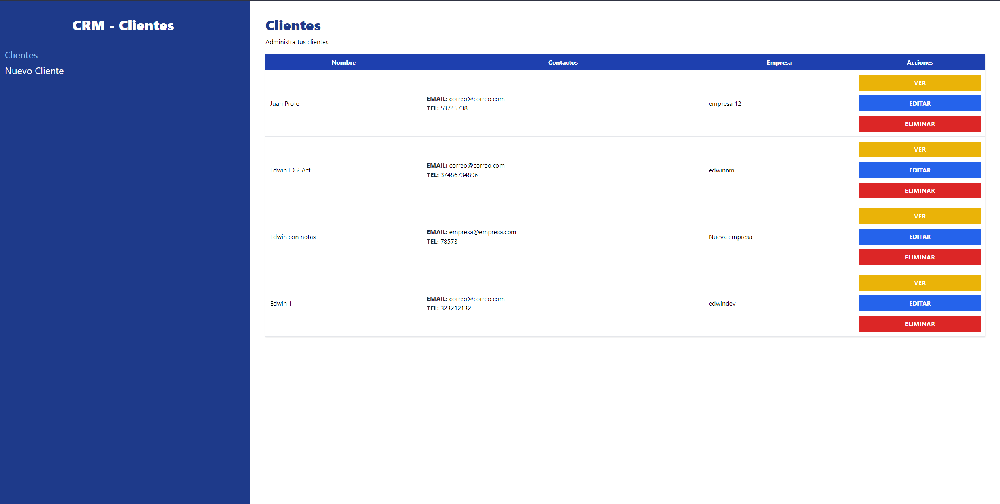

# Vet-App

API_CRM is an application for Customer Relationship Management.

The project was created with Vite, React, Formik, Yup, React-Router-DOOM and TailwindCSS.

This project includes and simple API using json-server. In Production Mode (DEMO) the changes are not saving.

This application has been created for educational purposes.

## Installation

- Clone the project.

- Run the command to install the dependencies.

```bash
npm install
```

- Run the command to start the development server.

```bash
npm run dev
```

## How to deploy in GH-Pages

- Add base in the vite.config.js file.

```js
export default defineConfig({
    base: '/API_CRM/',
    ...,
}
```
- If you are using React-Router-DOM > 4 version, change the basename too in BrowserRouter component.

```
  <BrowserRouter basename="/API_CRM">
```

- Run the command to build the project.
```bash
npm run build
```
- Add and push the static files generated in /dist.
```git
git add dist -f
git commit -m 'Adding dist'.
git subtree push --prefix dist origin gh-pages
```
## Usage
- Go to [this page](https://edwinnm.github.io/API_CRM/) for a demonstration.
  